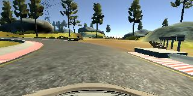
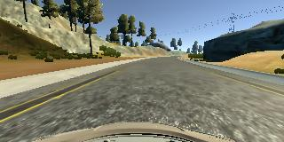
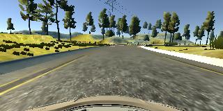

# **CarND-Behavioral-Cloning-P3**
My solution to Udacity Self-Driving Car behavioral cloning project 

My project includes the following files:
* model.py containing the script to create and train the model
* drive.py for driving the car in autonomous mode
* model-final.h5 containing a trained convolution neural network 

#### 2. Submission includes functional code
Using the Udacity provided simulator and my drive.py file, the car can be driven autonomously around the track by executing 
```sh
python drive.py model.h5
```

#### 3. Submission code is usable and readable

The model.py file contains the code for training and saving the convolution neural network. The file shows the pipeline used for loading data and then training and validating the model. Code is commented to explain how the code works.

### Model Architecture and Training Strategy

#### 1. An appropriate model architecture has been employed

For my model I've used network architecture described here: https://devblogs.nvidia.com/deep-learning-self-driving-cars/ with added dropout layers between fully connected layers.
Final network architecture obtained via summary() function in keras:
____________________________________________________________________________________________________
Layer (type)                     Output Shape          Param #     Connected to                     
====================================================================================================
lambda_14 (Lambda)               (None, 160, 320, 3)   0           lambda_input_14          
____________________________________________________________________________________________________
cropping2d_14 (Cropping2D)       (None, 65, 320, 3)    0           lambda_14              
____________________________________________________________________________________________________
convolution2d_66 (Convolution2D) (None, 31, 158, 24)   1824        cropping2d_14[             
____________________________________________________________________________________________________
convolution2d_67 (Convolution2D) (None, 14, 77, 36)    21636       convolution2d_66          
____________________________________________________________________________________________________
convolution2d_68 (Convolution2D) (None, 5, 37, 48)     43248       convolution2d_67         
____________________________________________________________________________________________________
convolution2d_69 (Convolution2D) (None, 3, 35, 64)     27712       convolution2d_68        
____________________________________________________________________________________________________
convolution2d_70 (Convolution2D) (None, 1, 33, 64)     36928       convolution2d_69         
____________________________________________________________________________________________________
flatten_14 (Flatten)             (None, 2112)          0           convolution2d_70         
____________________________________________________________________________________________________
dense_53 (Dense)                 (None, 100)           211300      flatten_14              
____________________________________________________________________________________________________
dropout_40 (Dropout)             (None, 100)           0           dense_53                  
____________________________________________________________________________________________________
dense_54 (Dense)                 (None, 50)            5050        dropout_40                
____________________________________________________________________________________________________
dropout_41 (Dropout)             (None, 50)            0           dense_54                 
____________________________________________________________________________________________________
dense_55 (Dense)                 (None, 10)            510         dropout_41                
____________________________________________________________________________________________________
dropout_42 (Dropout)             (None, 10)            0           dense_55                  
____________________________________________________________________________________________________
dense_56 (Dense)                 (None, 1)             11          dropout_42               
====================================================================================================
Total params: 348,219
Trainable params: 348,219
Non-trainable params: 0
____________________________________________________________________________________________________


#### 2. Attempts to reduce overfitting in the model

The model contains dropout layers in order to reduce overfitting. They are located between fully connected layers

Dataset has been split into train(80%) and validation(20%) set.

#### 3. Model parameter tuning

The model used an adam optimizer, so the learning rate was not tuned manually.

#### 4. Appropriate training data

Training data was chosen to keep the vehicle driving on the road. The data I used contain mainly driving in the center of the road. I also included recovery data, which consisted of driving from the side of the road back to the center.

### Model Architecture and Training Strategy

#### 1. Solution Design Approach

In the beginning I've started with LaNet architecture used in previous project. The model performed relatively well, but had problems on long curves. Then, I've moved to network architecture as described above, but without dropout layers at first. The model performed even better, but car got tendency to drift off at bridge and it didn't turn as expected near dirt road. To help with that I added more images to dataset, I've focused on things the network was struggling with. After this dataset grew large, so just to be sure I've added dropout layers between fully connected layers. This model was performing very well on the simulator and was capable of driving on the track without leaving the road, so I've decided that I'm going to submit it.

#### 2. Creation of the Training Set & Training Process

To capture good driving behavior, I first recorded two laps on track one using center lane driving. Here is an example image of center lane driving:




I then recorded the vehicle recovering from sides of the road and driving to the center




Then I repeated this process on track two in order to get more data points.

To augment the data sat, I flipped all the images and negated steering value.

I finally randomly shuffled the data set and put 20% of the data into a validation set. 

Model was trained on 3 epochs
